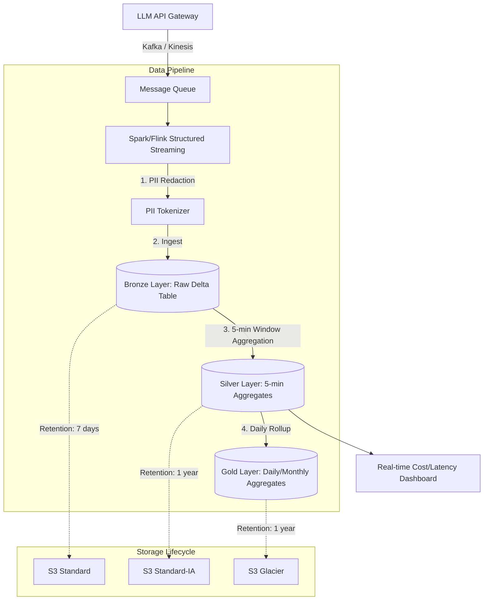

# Bonus Challenge: LLM Observability Architecture

## 1. Problem Statement
**Bài toán:** Hệ thống LLM Observability ghi nhận 1 tỷ requests/ngày (~5 TB/ngày raw). Yêu cầu:
- Dashboard real-time (refresh mỗi 5 phút) về cost và latency theo tenant.
- Giữ raw prompt/response trong 7 ngày để debug, sau đó chỉ giữ dữ liệu tổng hợp (aggregates) trong 1 năm.
- Dữ liệu PII phải được redact trước khi có bất kỳ truy cập nào.
- Ngân sách lưu trữ: ≤ $5,000/tháng.

**Vì sao khó:** Volume rất lớn (5 TB/ngày), đòi hỏi tốc độ ingest nhanh cho realtime dashboard, đi kèm các ràng buộc pháp lý (PII) và kinh tế (budget cap) rất khắt khe. Việc xử lý song song cả real-time aggregation và deep-storage retention là thách thức cốt lõi.

---

## 2. Architecture Diagram

---

## 3. Quyết định chính kèm Alternatives đã loại

**Quyết định 1: Chọn Delta Lake làm định dạng lưu trữ (Table Format).**
- *Lý do:* Hỗ trợ tốt ACID cho streaming (append liên tục) và khả năng dùng Time Travel để xử lý sự cố.
- *Loại bỏ Parquet thuần:* Vì không có ACID transactions, việc xử lý concurrent writes từ streaming và concurrent reads từ dashboard sẽ gây crash hoặc hỏng file.
- *Loại bỏ Apache Iceberg:* Iceberg cũng tốt nhưng hệ sinh thái Databricks / Spark Streaming hỗ trợ Delta Lake out-of-the-box ổn định hơn cho use-case có độ trễ cực thấp (micro-batching).

**Quyết định 2: Tokenization (PII Redaction) thực hiện tại lúc Ingestion trước khi ghi vào Bronze.**
- *Lý do:* Đảm bảo không có PII nào lọt vào ổ cứng vật lý. An toàn tuyệt đối về mặt pháp lý và bảo mật.
- *Loại bỏ Redact on Read (Dynamic Masking):* Rất nguy hiểm vì dữ liệu thô vẫn tồn tại trên ổ đĩa. Nếu ai đó có quyền đọc trực tiếp S3 bucket, dữ liệu PII sẽ bị lộ.
- *Loại bỏ Job Redact định kỳ (Batch):* Trong khoảng thời gian giữa lúc ghi thô và lúc batch chạy, PII vẫn tồn tại và có nguy cơ rò rỉ.

**Quyết định 3: Partition theo `date` và Z-Order theo `tenant_id` tại lớp Bronze.**
- *Lý do:* Mỗi ngày 5TB, partition theo ngày là vừa phải (tránh tạo quá nhiều folder). Truy vấn thường là "xem của khách hàng A" nên Z-Order theo `tenant_id` sẽ giúp Data Skipping hiệu quả.
- *Loại bỏ Partition theo `tenant_id`:* Sẽ gây ra vấn đề "Small File Problem" và Data Skew trầm trọng vì có những khách hàng siêu lớn và hàng vạn khách hàng siêu nhỏ.

**Quyết định 4: Sử dụng S3 Lifecycle Rules kết hợp `VACUUM` thay vì tự xóa (Manual Delete) cho Bronze.**
- *Lý do:* Bronze chỉ cần lưu 7 ngày. Dùng Lifecycle Rule giúp tự động chuyển dữ liệu quá 7 ngày vào thùng rác mà không tốn tài nguyên compute để chạy script xóa. Delta `VACUUM` sẽ hỗ trợ xóa các metadata và data file rác trong delta_log.
- *Loại bỏ tự viết script xóa thủ công:* Dễ lỗi, không robust, nếu script tèo thì ổ cứng sẽ nổ (vượt budget).

**Quyết định 5: Streaming Aggregation (Silver) chạy độc lập với Batch Rollup (Gold).**
- *Lý do:* Silver dùng watermarking tính toán cost/latency mỗi 5 phút phục vụ Dashboard. Gold chạy hàng ngày để tối ưu dữ liệu dài hạn (1 năm).
- *Loại bỏ Batch-only:* Sẽ không đáp ứng được SLA "dashboard refresh mỗi 5 phút".

---

## 4. Failure Modes

**Sự cố 1: PII Redaction bị hỏng do thay đổi Regex (lọt PII vào Bronze)**
- *Phát hiện:* Thông qua PII detection sampling job chạy mỗi 15 phút.
- *Rollback:* Dùng Delta Lake `RESTORE TO VERSION AS OF` (Time Travel) để quay lại phiên bản trước khi lọt PII, update lại Regex, sau đó chạy luồng streaming để nạp lại từ Kafka offset tương ứng.

**Sự cố 2: Bùng nổ "Small File Problem" do lưu lượng tăng đột biến**
- *Phát hiện:* Lượng file trong S3 bucket tăng vọt, thời gian query của Dashboard bị chậm (latency spike).
- *Khắc phục:* Tạm thời kích hoạt Auto Optimize trên Databricks (hoặc tăng tần suất chạy cron job `OPTIMIZE + Z-ORDER`) lên mỗi 15 phút thay vì hàng đêm để gộp các file nhỏ lại liên tục.

**Sự cố 3: Consumer Lag do Spike (Khách hàng gọi API 1 tỷ lần trong 1 giờ thay vì 1 ngày)**
- *Phát hiện:* Kafka consumer lag monitor báo động đỏ.
- *Khắc phục:* Tự động scale out số lượng worker nodes của cụm Spark Structured Streaming. Data sẽ được nạp chậm hơn một chút nhưng không bị mất nhờ Kafka persistence. 

---

## 5. Ước lượng chi phí (Back-of-envelope)

* Ngân sách yêu cầu: ≤ $5,000/tháng.

**Storage Cost (Amazon S3):**
- **Bronze (7 ngày retention):** 5 TB/ngày × 7 ngày = 35 TB. 
  S3 Standard price: ~$23/TB/tháng.
  => 35 TB × $23 = **$805/tháng.**
- **Silver & Gold (1 năm retention, Aggregated):** 
  Sau khi tổng hợp, 5TB raw chỉ còn khoảng 10 GB/ngày. 
  1 năm = 3650 GB = ~3.6 TB. 
  S3 Standard-IA price: ~$12.5/TB/tháng. 
  => 3.6 TB × $12.5 = **$45/tháng.**

**Compute Cost (Databricks / EMR):**
- Streaming cluster nhỏ chạy 24/7 xử lý ingestion và PII redaction: ~4 nodes (máy 16GB RAM) = ~$1,500/tháng.
- Maintenance Jobs (`OPTIMIZE`, `VACUUM` chạy ban đêm): ~$200/tháng.
- Dashboard query compute: Serverless SQL/Athena: ~$300/tháng.
=> Tổng Compute: **~$2,000/tháng.**

**TỔNG CỘNG:** $805 + $45 + $2000 = **$2,850/tháng** (Hoàn toàn nằm trong budget $5K).

---

## 6. Build Cái Gì Trước (MVP 1 tuần)

Slice nhỏ nhất (Minimal Viable Product) để chứng minh tính khả thi:
1. Viết một script Python đơn giản đẩy giả lập 1,000 requests/giây vào Kafka/Kinesis.
2. Xây dựng Spark Streaming job đọc data, áp dụng thuật toán PII Redaction (che email/SĐT), và ghi vào Delta Lake (Bronze).
3. Chứng minh cơ chế bảo mật: Đọc thử Bronze layer để xác nhận PII đã bị che hoàn toàn.
4. Chứng minh tốc độ ghi: Kiểm tra file Parquet sinh ra và chạy lệnh `OPTIMIZE` thủ công để thấy sự giảm thiểu số lượng file.
(Chưa cần dựng Silver/Gold layer trong tuần đầu tiên).
